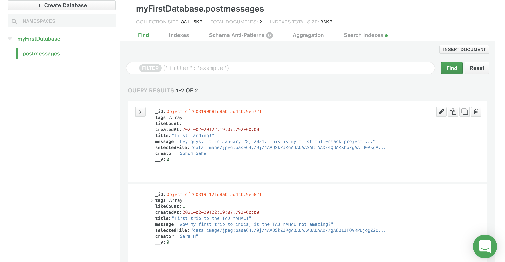
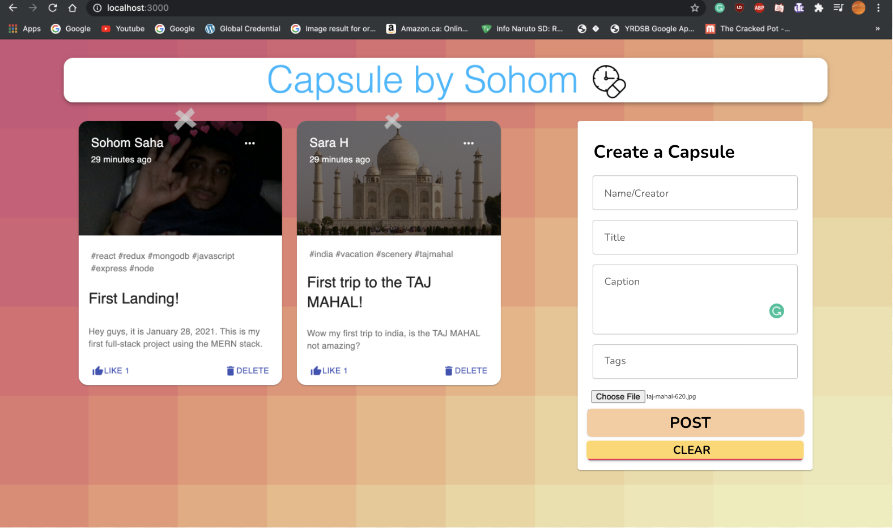

# Capsule
Capsule is a social media app, that lets you share fragments of your life to be archived forever!

## Inspiration

I wanted to create a time capsule for the internet, where strangers can post memories with a date and time, including pictures, captions and tags. Who knows what interesting fragments of the human race will be buried in #Capsule from months,years or decades to come!

## How Capsule Works

When users are on the application, they have to option to put their name down, as well as a title and caption for their post. They can then choose an image from their device and put any tags if they want. Then they can click "submit" to post their picture. You can like a post and the user themselves can delete their own.

## How to run Capsule

Setup:
- Initialize a dual terminal then type ``` cd client``` for the client terminal and ```cd server``` for the server terminal
- run ```npm i && npm start``` for both client and server side

## Technologies used to build Capsule

Stack: MERN --> (MongoDB, Express, React.js, Node.js)

Database: MongoDB 

Modules used:

- react-redux
- mongoose
- redux-thunk
- axios
- cors
- body-parser
- nodemon
- @material-ui (styling)

## How Capsule Works

Lets first look at the server side of the application, 

In the MERN stack, MongoDB, Express and Node.js make up the backend, in this case they handle the HTTP requests and data stored in each "Capsule"
information like, the captions, times, tags names etc. are then send to the NoSQL database

MongoDB horizontal scalability means support for up to 7000 users.

#### MongoDB setup and user data breakdown


Now we can examine the frontend of the application,


#### User Experience 




## Next Steps

Some next steps that I am currently working on is to implement a user authentication system using Google OAuth. This will allow users to be able to login to their own personal accounts rather than just add a post from anywhere.


#### Reflection

This was my first MERN fullstack application and I learned so much! From working with MongoDB for the first time and using React instead of the usual Angular, it was lots of fun to play around with the great functionalities of React, my next step is to work towards the LAMP stack, something I've been meaning to do. I also want to improve the state managment of the current app and implement Hooks. Some functionalities use hooks but majority have not been changed as of.


